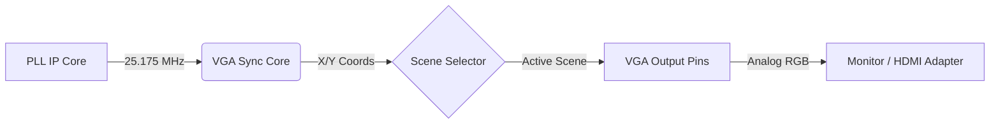

<div align="center">

# FPGA VGA Driver

**A Verilog HDL implementation of a VGA driver for the Intel/Altera Cyclone IV FPGA.**


</div>

## Overview

This repository contains a VGA video controller designed for the Intel Cyclone IV FPGA. The goal was to build a clean, reusable IP core that handles video timing constraints independently of the visual content.

The system generates a standard 640x480 @ 60Hz signal using a 25.175MHz pixel clock. It separates the VGA [Core](/rtl/core) logic from the rendering logic, allowing for rapid development of different visual [Scenes](/rtl/scenes) (images/video) without touching the timing backend.

## System Architecture

The design is split into three layers:



## Components
1.  **System PLL (`sys_pll.v`)**: Uses a Phase-Locked Loop (PLL) on the FPGA to synthesize a 25.175 MHz pixel clock from the 50 MHz system clock.
2.  **VGA Sync Core (`vga_sync.v`)**: Controls timing by generating H-Sync and V-Sync signals and tracks the current X/Y pixel coordinates.
3.  **Scene Renderer (`scenes/*.v`)**: Used for rendering images/video, these take pixel coordinates as input and output RGB values.
4.  **VGA Driver (`vga_driver.v`)**: The top-level module that combines the PLL, sync and renderer to send outputs to the VGA port on the FPGA board.

## Timing Specifications

The driver is set up for 640x480 resolution @ 60Hz refresh rate.
* Pixel Clock: 25.175 MHz (Synthesized via PLL)
* Horizontal Line: 800 pixel clock cycles (~31.5 kHz)
* Vertical Frame: 524 Lines (~60 Hz)

| Parameter | Horizontal value (pixels) | Vertical value (lines) |
| :--- | :---: | :---: |
| **Visible Area** | 640 | 480 |
| **Front Porch** | 24 | 7 |
| **Sync Pulse** | 96 | 2 |
| **Back Porch** | 40 | 35 |
| **Total** | **800** | **524** |

## Hardware Implementation

The project was originally designed for the Intel Cyclone IV EP4CE6E22C8N FPGA on the RZ-EasyFPGA A2.2 / RZ-EP4CE6-WX board by Ruizhi Technology Co, but can be reused for a variety of boards. Output is driven via the onboard VGA port to a standard monitor using a VGA-to-HDMI adapter.

* FPGA: [Intel Cyclone IV EP4CE6E22C8N](https://www.intel.com/content/www/us/en/products/sku/210472/cyclone-iv-ep4ce6-fpga/specifications.html)
* FPGA Development Board: [RZ-EasyFPGA A2.2 / RZ-EP4CE6-WX board](https://web.archive.org/web/20210128152708/http://rzrd.net/product/?79_502.html)
* VGA-to-HDMI Adapter: [eBay Listing](https://www.ebay.com.au/itm/302905294205)
* Monitor: [Dell 24 200Hz Monitor SE2425HG](https://www.dell.com/en-au/shop/dell-24-200hz-monitor-se2425hg/apd/210-bsgw/computer-monitors)

### Pinout Configuration

| Signal Name | FPGA Pin | Description |
| :--- | :--- | :--- |
| `sys_clk` | **PIN_23** | 50MHz Master Clock |
| `rst` | **PIN_25** | Reset Button (Active Low) |
| `h_sync` | **PIN_101** | Horizontal Sync |
| `v_sync` | **PIN_103** | Vertical Sync |
| `red` | **PIN_106** | Red Channel (1-bit) |
| `green` | **PIN_105** | Green Channel (1-bit) |
| `blue` | **PIN_104** | Blue Channel (1-bit) |

*Note: The board uses 1kΩ series resistors for color channels, resulting in ~0.2V signal levels, or 33% colour brightness.*  


## Render Scenes

The repository currently includes the following render scenes:

## Modular Scenes

The repository currently includes the following render scenes:

* **`bouncing_ball_2d.v`**: A collision physics demonstration featuring a square object with 2D velocity vectors.
* **`bouncing_ball_1d.v`**: A simplified collision physics test with horizontal-only movement logic.
* **`sliding_square.v`**: A basic animation test featuring a square that wraps around the screen edges.
* **`fill_with_border.v`**: A static calibration tool for verifying the active video region boundaries.
* **`alternating_colours.v`**: A color integrity test displaying cycling RGB vertical bars.

## Directory Structure

```text
├── rtl/
│   ├── core/
│   │   ├── sys_pll.v             # PLL Clock Generator
│   │   ├── vga_driver.v          # Top Level Wrapper
│   │   └── vga_sync.v            # Timing Generator
│   └── scenes/
│       ├── alternating_colours.v # Calibration Pattern
│       ├── bouncing_ball_1d.v
│       ├── bouncing_ball_2d.v    # Physics Demo
│       ├── fill_with_border.v
│       └── sliding_square.v
├── quartus/                      # Project Files
└── tb/                           # Testbenches
    └── vga_sync_tb.v
```
